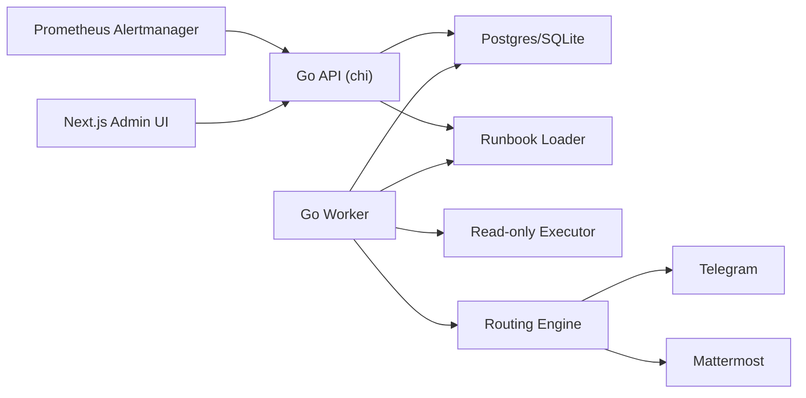
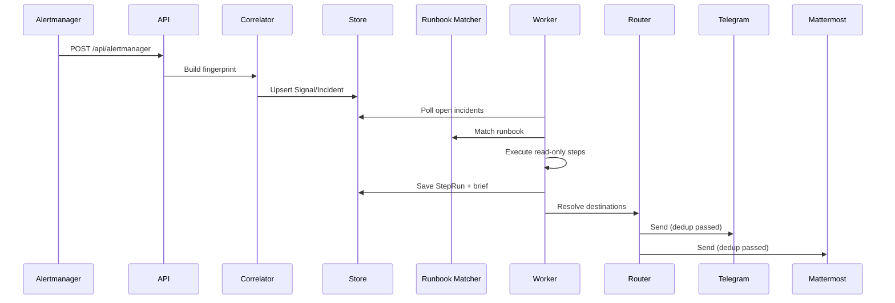

# Runbook Hunter

Runbook Hunter is a Kubernetes-first incident hunter: it receives Prometheus Alertmanager webhooks, correlates incidents, runs read-only runbook checks, and posts deduplicated updates to Telegram and/or Mattermost.

Security notes:
- MVP is strictly read-only for infrastructure actions.
- Secrets are sourced from Kubernetes Secret or encrypted UI overrides.
- Tokens/webhooks must never be logged.

## Features (MVP)
- Go backend (`api` + `worker` modes) and Next.js admin UI.
- Alertmanager webhook ingest: `POST /api/alertmanager`.
- Config precedence: `UI overrides > ConfigMap defaults > built-in defaults`.
- Deterministic configurable fingerprint.
- Runbook sources: files (`/runbooks/*.yaml`) or DB mode.
- Read-only tools: `http_get`, `dns_lookup`, `tcp_check`, `fetch_json`.
- Destination routing + per-destination dedup (`content_hash + cooldown`).
- Health and observability: `/healthz`, `/readyz`, `/metrics`.

## Architecture
- `api` Deployment: ingest, UI/API config, incidents API.
- `worker` Deployment: always-on loop for open incidents.
- `ui` Deployment: admin interface.

Single Helm release deploys all components.





## Local Run (Docker Compose)
```bash
docker compose up --build
```

Compose uses [examples/local/config.yaml](/Users/mharchuk/Documents/awsapp/examples/local/config.yaml) and local Postgres.

Endpoints:
- API: [http://localhost:8080](http://localhost:8080)
- UI: [http://localhost:3000](http://localhost:3000)

## Helm Install
```bash
helm install runbook-hunter ./deploy/helm/runbook-hunter -f examples/k8s/values-minimal.yaml
```

## Configure Alertmanager
Use [examples/alertmanager/alertmanager.yml](/Users/mharchuk/Documents/awsapp/examples/alertmanager/alertmanager.yml) receiver webhook pointing to service/ingress `/api/alertmanager`.

## Settings Precedence and Overrides
Effective settings are merged in this order:
1. Built-in defaults
2. Config file from ConfigMap/Secret
3. UI overrides in DB

API endpoints:
- `GET /api/settings/effective`
- `GET /api/settings/overrides`
- `PUT /api/settings/overrides`
- `POST /api/settings/overrides/reset`

Reset payloads:
- Global reset:
```json
{ "scope": "all" }
```
- Selective reset:
```json
{ "scope": "keys", "keys": ["routing.rules", "destinations.telegram"] }
```

UI contains both buttons: reset all and reset keys.

Security notes:
- UI overrides are encrypted at rest (AES-256-GCM) using key from `RH_SETTINGS_CRYPTO_KEY`.
- If key is missing, override writes are rejected.

## Telegram and Mattermost templates
Telegram:
- `🚨 [{{severity}}] {{alertname}}`
- `Service: {{service}} | Env: {{env}}`
- `Incident: #{{incident_id}} | Status: {{status}}`
- `Summary: {{brief}}`
- `Runbook: {{runbook_name}}`
- `Updated: {{updated_at}}`

Mattermost markdown:
- `### :rotating_light: [{{severity}}] {{alertname}}`
- `**Service:** {{service}}  |  **Env:** {{env}}`
- `**Incident:** #{{incident_id}}  |  **Status:** {{status}}`
- `**Summary:** {{brief}}`
- `**Runbook:** {{runbook_name}}`
- `_Updated: {{updated_at}}_`

Dedup:
- `content_hash = sha256(normalized_message_text)`
- State key: `(incident_id, destination_id)`
- Skip if same hash within cooldown unless force post.

## API Summary
- `POST /api/alertmanager`
- `GET /api/incidents`
- `GET /api/incidents/{id}`
- `POST /api/incidents/{id}/post-update`
- `GET /api/settings/effective`
- `GET /api/settings/overrides`
- `PUT /api/settings/overrides`
- `POST /api/settings/overrides/reset`
- `GET /healthz`
- `GET /readyz`
- `GET /metrics`

## Security checklist
- Keep `RH_AUTH_BASIC_PASS`, bot tokens, webhook URLs, JWT secret in Kubernetes Secret.
- Restrict executor egress with `security.egressAllowlist`.
- Keep write-actions disabled in MVP.
- Rotate secrets if exposed.

## Repo map
- Backend: [backend](/Users/mharchuk/Documents/awsapp/backend)
- Frontend: [frontend](/Users/mharchuk/Documents/awsapp/frontend)
- Helm: [deploy/helm/runbook-hunter](/Users/mharchuk/Documents/awsapp/deploy/helm/runbook-hunter)
- Runbooks: [runbooks](/Users/mharchuk/Documents/awsapp/runbooks)
- Examples: [examples](/Users/mharchuk/Documents/awsapp/examples)

## Improvements after MVP
1. Parallel step threads.
2. Fine-grained RBAC.
3. Multi-tenant isolation.
4. Approval workflow for write actions.
5. Additional sources (Grafana Alerting/PagerDuty).
6. Visual runbook editor.
7. SSO (OIDC/SAML).
8. Delivery queue + DLQ.
9. Similarity clustering.
10. Tamper-evident audit log.
